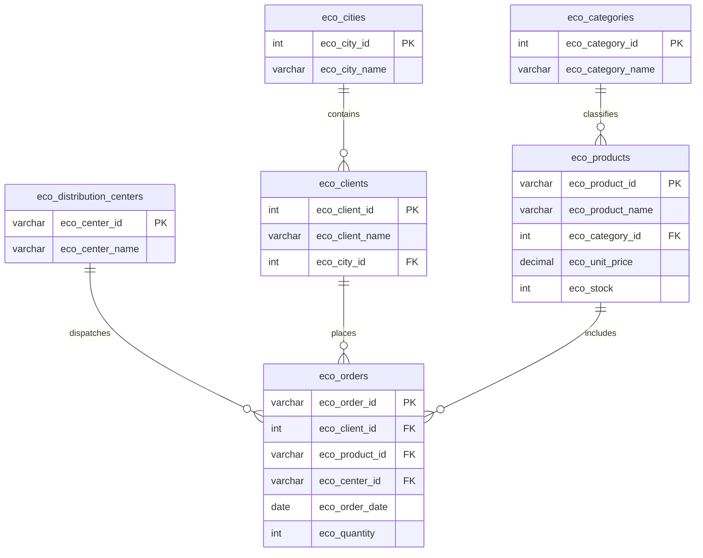

# ECO Grocery Supply Chain Database 

A robustly normalized relational database system designed to optimize order tracking, inventory management, and regional logistics for an agricultural grocery distribution business in Colombia.

## 📄 Project Description
This project transforms a flat, unorganized spreadsheet containing transaction and inventory logs into a highly scalable, transactional SQL database system. By decomposing data into logically isolated entities with structural integrity rules, the system eliminates data duplication, protects historical reporting, and accelerates operational analysis across multiple retail locations.

---

## 🛠️ Technologies
*   **Data Modeling Language:** SQL Standard (ANSI-SQL)
*   **Documentation Formatting:** Markdown (MD)
*   **Visualization System:** Mermaid.js Graph Language

---

## 🗄️ Database Engine
This architecture is developed using standard **ANSI-SQL** commands (`CREATE TABLE`, `FOREIGN KEY`, `INSERT INTO`). It offers complete out-of-the-box compatibility with leading Relational Database Management Systems (RDBMS) including:
*   **PostgreSQL** (14.0+)
*   **MySQL** (8.0+)
*   **Microsoft SQL Server** (2019+)

---

## 🧠 Normalization Process

The source dataset presented severe structural anomalies, including customer name repetition, transitively dependent logistical fields, and linear inventory logging within an order ledger. The normalization process was systematically executed across three stages:

### First Normal Form (1FN)
*   **Requirement:** Atomic values and definition of a unique identifier.
*   **Action:** Ensured all individual attributes contained single values. The field `eco_order_id` was selected as the Primary Key for the transactional core.

### Second Normal Form (2FN)
*   **Requirement:** Meet 1FN and ensure all non-key attributes depend fully on the primary key.
*   **Action:** Identified that customer names (`eco_client_name`) and locations did not depend on the product transaction itself. They were isolated into an independent customer table.

### Third Normal Form (3FN)
*   **Requirement:** Meet 2FN and eliminate all transitive dependencies (attributes relying on other non-key attributes).
*   **Action:** 
    *   Isolated logistical fields (`eco_category_name`, `eco_center_name`) that relied strictly on product taxonomy rather than the transactional order metadata.
    *   Isolated geographic entities (`eco_city_name`) into a separate master lookup table to prevent redundant text entries and streamline regional hierarchy.
    *   Moved physical stock counts (`eco_stock`) into the product catalog table, decoupling dynamic current inventory from fixed historical ledger receipts.

---

## 📊 Database Schema
The final system relies on 6 dedicated relations enforcing rigorous naming conventions using the corporate prefix **`eco_`**:

*   **`eco_cities`** (`eco_city_id` [PK], `eco_city_name`)
*   **`eco_categories`** (`eco_category_id` [PK], `eco_category_name`)
*   **`eco_distribution_centers`** (`eco_center_id` [PK], `eco_center_name`)
*   **`eco_clients`** (`eco_client_id` [PK], `eco_client_name`, *`eco_city_id`* [FK])
*   **`eco_products`** (`eco_product_id` [PK], `eco_product_name`, *`eco_category_id`* [FK], `eco_unit_price`, `eco_stock`)
*   **`eco_orders`** (`eco_order_id` [PK], *`eco_client_id`* [FK], *`eco_product_id`* [FK], *`eco_center_id`* [FK], `eco_order_date`, `eco_quantity`)

---

## 📐 Entity Relationship Diagram

The following relationship structure shows how master entities pass constraints down into the central transactional order logger.



---

## ⚙️ Database Creation Instructions
To build the database and implement its referential parameters, execute the following block inside your database manager query tool:

```sql
CREATE TABLE eco_cities (
    eco_city_id INT PRIMARY KEY,
    eco_city_name VARCHAR(50) NOT NULL
);

CREATE TABLE eco_categories (
    eco_category_id INT PRIMARY KEY,
    eco_category_name VARCHAR(50) NOT NULL
);

CREATE TABLE eco_distribution_centers (
    eco_center_id VARCHAR(10) PRIMARY KEY,
    eco_center_name VARCHAR(50) NOT NULL
);

CREATE TABLE eco_clients (
    eco_client_id INT PRIMARY KEY,
    eco_client_name VARCHAR(100) NOT NULL,
    eco_city_id INT NOT NULL,
    FOREIGN KEY (eco_city_id) REFERENCES eco_cities(eco_city_id)
);

CREATE TABLE eco_products (
    eco_product_id VARCHAR(10) PRIMARY KEY,
    eco_product_name VARCHAR(100) NOT NULL,
    eco_category_id INT NOT NULL,
    eco_unit_price DECIMAL(10, 2) NOT NULL,
    eco_stock INT NOT NULL,
    FOREIGN KEY (eco_category_id) REFERENCES eco_categories(eco_category_id)
);

CREATE TABLE eco_orders (
    eco_order_id VARCHAR(10) PRIMARY KEY,
    eco_client_id INT NOT NULL,
    eco_product_id VARCHAR(10) NOT NULL,
    eco_center_id VARCHAR(10) NOT NULL,
    eco_order_date DATE NOT NULL,
    eco_quantity INT NOT NULL,
    FOREIGN KEY (eco_client_id) REFERENCES eco_clients(eco_client_id),
    FOREIGN KEY (eco_product_id) REFERENCES eco_products(eco_product_id),
    FOREIGN KEY (eco_center_id) REFERENCES eco_distribution_centers(eco_center_id)
);
```

---

## 📥 Data Loading Instructions
To safely populate your database environment, execute these insert commands sequentially to prevent foreign key mismatch or dependency blocking errors:

```sql
-- Step 1: Populate Cities
INSERT INTO eco_cities (eco_city_id, eco_city_name) VALUES
(1, 'Bogotá'), (2, 'Medellín'), (3, 'Cali'), (4, 'Barranquilla'), (5, 'Cartagena'),
(6, 'Bucaramanga'), (7, 'Pereira'), (8, 'Manizales'), (9, 'Cúcuta');

-- Step 2: Populate Categories
INSERT INTO eco_categories (eco_category_id, eco_category_name) VALUES
(1, 'Fruits'), (2, 'Dairy'), (3, 'Meat'), (4, 'Grains'), (5, 'Oils'), (6, 'Vegetables');

-- Step 3: Populate Logistical Hubs
INSERT INTO eco_distribution_centers (eco_center_id, eco_center_name) VALUES
('CD01', 'North Center'), ('CD02', 'West Center'), ('CD03', 'South Hub'),
('CD04', 'Coast DC'), ('CD05', 'East Hub'), ('CD06', 'Coffee DC');

-- Step 4: Populate Clients
INSERT INTO eco_clients (eco_client_id, eco_client_name, eco_city_id) VALUES
(1, 'SuperMax', 1), (2, 'FreshMart', 2), (3, 'MiniShop', 3), (4, 'SuperMax', 4), (5, 'EcoStore', 5),
(6, 'MarketOne', 6), (7, 'RetailCo', 7), (8, 'FoodPlus', 8), (9, 'GreenBuy', 1), (10, 'QuickFood', 9);

-- Step 5: Populate Master Product Catalog
INSERT INTO eco_products (eco_product_id, eco_product_name, eco_category_id, eco_unit_price, eco_stock) VALUES
('P01', 'Gala Apple', 1, 2.50, 100), ('P02', 'Banana', 1, 1.20, 180), ('P03', 'Whole Milk 1L', 2, 3.80, 60),
('P04', 'Chicken Breast', 3, 6.50, 70), ('P05', 'Rice 1kg', 4, 2.00, 200), ('P06', 'Extra Virgin Olive Oil', 5, 8.90, 40),
('P07', 'Eggs x12', 2, 4.20, 90), ('P08', 'Tomato', 6, 1.80, 120), ('P09', 'Iceberg Lettuce', 6, 1.10, 50),
('P10', 'Spaghetti', 4, 2.30, 140);

-- Step 6: Load Transaction Ledger Records
INSERT INTO eco_orders (eco_order_id, eco_client_id, eco_product_id, eco_center_id, eco_order_date, eco_quantity) VALUES
('O1001', 1, 'P01', 'CD01', '2026-05-01', 10), ('O1002', 1, 'P01', 'CD01', '2026-05-02', 5),
('O1003', 2, 'P02', 'CD02', '2026-05-02', 20), ('O1004', 2, 'P02', 'CD02', '2026-05-03', 15),
('O1005', 3, 'P03', 'CD03', '2026-05-04', 12), ('O1006', 3, 'P03', 'CD03', '2026-05-05', 8),
('O1007', 4, 'P04', 'CD04', '2026-05-06', 25), ('O1008', 4, 'P04', 'CD04', '2026-05-07', 10),
('O1009', 5, 'P05', 'CD04', '2026-05-08', 30), ('O1010', 5, 'P05', 'CD04', '2026-05-09', 18),
('O1011', 6, 'P06', 'CD05', '2026-05-10', 6),  ('O1012', 6, 'P06', 'CD05', '2026-05-11', 4),
('O1013', 7, 'P07', 'CD06', '2026-05-12', 14), ('O1014', 7, 'P07', 'CD06', '2026-05-13', 9),
('O1015', 8, 'P08', 'CD06', '2026-05-14', 22), ('O1016', 8, 'P08', 'CD06', '2026-05-15', 16),
('O1017', 9, 'P09', 'CD01', '2026-05-16', 11), ('O1018', 9, 'P09', 'CD01', '2026-05-17', 7),
('O1019', 10, 'P10', 'CD05', '2026-05-18', 19),('O1020', 10, 'P10', 'CD05', '2026-05-19', 13);
```

---

## 🔍 SQL Query Explanation
To validate the model normalization and extract essential business insights, three primary queries are utilized:

### 1. Available Stock Level Per Product
Extracts real-time inventory assets directly from the specialized `eco_products` master catalog table. It avoids historical transactional scanning, making it fast and accurate.
```sql
SELECT eco_product_id, eco_product_name, eco_stock FROM eco_products ORDER BY eco_stock ASC;
```

### 2. Transactional Ledger Records Arranged by City
Performs multi-table links (`JOIN`) connecting orders, clients, and cities. This structure separates geographic names from order instances, eliminating manual string-matching errors while tracking historical dates and items.
```sql
